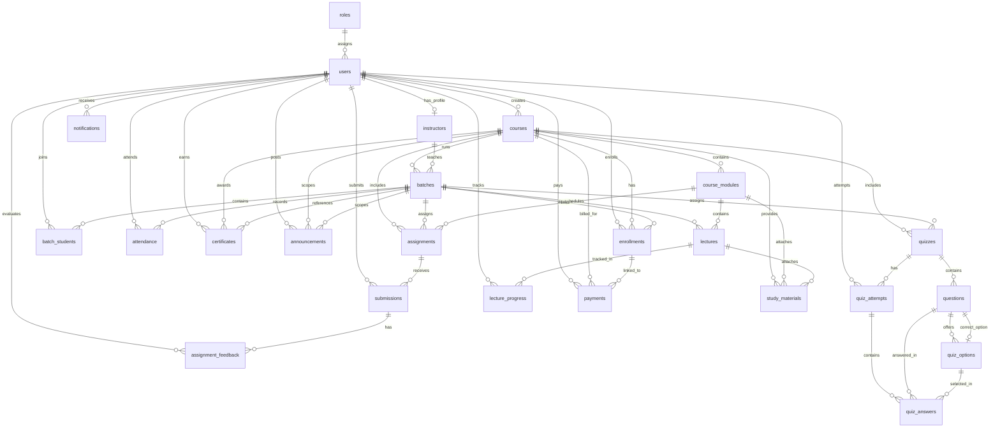

# LMS Entity-Relationship Diagram

```mermaid
erDiagram
    roles ||--o{ users : "assigns"
    users ||--o| instructors : "has_profile"
    users ||--o{ courses : "creates"
    users ||--o{ enrollments : "enrolls"
    users ||--o{ batch_students : "joins"
    users ||--o{ submissions : "submits"
    users ||--o{ assignment_feedback : "evaluates"
    users ||--o{ quiz_attempts : "attempts"
    users ||--o{ attendance : "attends"
    users ||--o{ lecture_progress : "tracks"
    users ||--o{ certificates : "earns"
    users ||--o{ payments : "pays"
    users ||--o{ notifications : "receives"
    users ||--o{ announcements : "posts"

    courses ||--o{ course_modules : "contains"
    courses ||--o{ batches : "runs"
    courses ||--o{ enrollments : "has"
    courses ||--o{ study_materials : "provides"
    courses ||--o{ assignments : "includes"
    courses ||--o{ quizzes : "includes"
    courses ||--o{ certificates : "awards"
    courses ||--o{ payments : "billed_for"
    courses ||--o{ announcements : "scopes"

    instructors ||--o{ batches : "teaches"

    batches ||--o{ batch_students : "contains"
    batches ||--o{ enrollments : "assigns"
    batches ||--o{ lectures : "schedules"
    batches ||--o{ assignments : "assigns"
    batches ||--o{ quizzes : "assigns"
    batches ||--o{ attendance : "records"
    batches ||--o{ certificates : "references"
    batches ||--o{ announcements : "scopes"

    course_modules ||--o{ lectures : "contains"
    course_modules ||--o{ study_materials : "attaches"
    course_modules ||--o{ assignments : "links"

    lectures ||--o{ study_materials : "attaches"
    lectures ||--o{ lecture_progress : "tracked_in"

    assignments ||--o{ submissions : "receives"
    submissions ||--o{ assignment_feedback : "has"

    quizzes ||--o{ questions : "contains"
    quizzes ||--o{ quiz_attempts : "has"
    questions ||--o{ quiz_options : "offers"
    questions ||--o| quiz_options : "correct_option"
    quiz_attempts ||--o{ quiz_answers : "contains"
    questions ||--o{ quiz_answers : "answered_in"
    quiz_options ||--o{ quiz_answers : "selected_in"

    enrollments ||--o{ payments : "linked_to"
```
